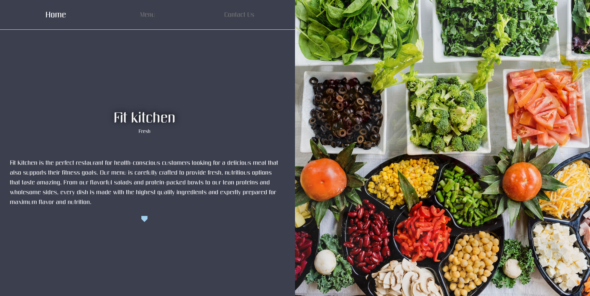

# restaurant-page

## compiling and running live

in root directory, type the following:

`npm install`

`npm run serve`

### screenshot

### live preview

[live code](https://charleygordon.github.io/restaurant-page)

### images used for project:

- https://unsplash.com/photos/vA1L1jRTM70
- https://unsplash.com/photos/KPDbRyFOTnE
- https://unsplash.com/photos/4_jhDO54BYg
- https://unsplash.com/photos/Xboa6hvS_5Q
- https://unsplash.com/photos/w0JzqJZYX_E
- https://unsplash.com/photos/37oYY2wHu0Q
- https://unsplash.com/photos/GmT8aOHR7Co
- https://unsplash.com/photos/JdFXBzf9gnA
- https://unsplash.com/photos/T41m4piMbNA
- https://unsplash.com/photos/LUv656869_A
- https://unsplash.com/photos/XqYlvd5DGKA
